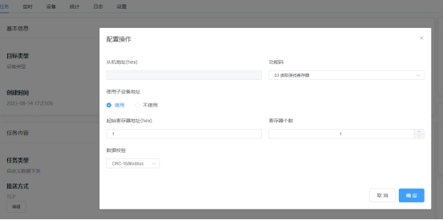

# Modbus寄存器设置

Modbus寄存器设置可以理解为专门为Modbus协议类设备开发的一个快捷、方便、易用的规则。

当设备类型的接入协议选择 Modbus RTU透传时，便可以在设备类型详情页中显示 Modbus配置，用于将设备属性和Modbus寄存器进行绑定，实现设备属性和 Modbus消息之间的自动转换，例如：

- 当云平台对设备下发一个开关量属性，由于这个属性绑定了一个设备上的读写类IO寄存器，那么实际下发到设备的消息，是一个 Modbus写入寄存器的消息报文。
- 当云平台通过任务向设备下发Modbus查询消息后，设备立即回应Modbus 响应消息，这时候云平台通过配置好的Modbus 寄存器，将自动解析 Modbus 消息，生成相应的属性值。

## 属性智能转换

这是一个全局的开关，开启后，平台将使用Modbus寄存器地址表，自动解析设备上报的Modbus消息，并将属性下发转换为Modbus消息。

## 选择自定义数据流

Modbus配置中需要设置自定义数据流，需要和Modbus透传用到的自定义数据流标识符保持一致。

推送方式支持MQTT和TCP，请选择设备实际接入的方式。

## 设置IO寄存器

IO寄存器的设置比较简单，点击***编辑IO寄存器***，IO寄存器处于可编辑状态，点击***添加一个寄存器或者添加多个寄存器***。

其中的属性，需要先在功能定义中创建，然后在添加Modbus寄存器时直接选择即可。

> **⚠️ 注意**
>
> IO寄存器必须绑定到开关量（Boolean）属性上，且仅支持`设备上报`和`设备云端共享`两种类型的属性。

## 设置数据寄存器

新增数据寄存器流程与IO寄存器一致。

> **⚠️ 注意**
>
> 数据寄存器必须绑定到数值型（Number）属性上，且仅支持`设备上报`和`双向传输`两种类型的属性。

### 数据寄存器数据类型

平台对Modbus数值寄存器进行消息生成和自动解析时，支持以下数据类型：

| 数据类型 | 寄存器个数 | 字节数 | 位数 | 字节顺序 |
| --- | --- | --- | --- | --- |
| 16位整数 | 1 | 2 | 16 | AB/BA |
| 16位无符号整数 | 1 | 2 | 16 | AB/BA |
| 32位整数 | 2 | 4 | 32 | ABCD/BADC/CDAB/DCBA |
| 32位无符号整数 | 2 | 4 | 32 | ABCD/BADC/CDAB/DCBA |
| 32位浮点数 | 2 | 4 | 32 | ABCD/BADC/CDAB/DCBA |

### 寄存器读写类型

在配置寄存器时，需要为寄存器选择准确的读写类型。

1)对于 ***IO寄存器***，读写类型表示以下含义：

| 读写类型 | 寄存器类型 | 读功能码 | 写功能码 |
| --- | --- | --- | --- |
| 只读 | 读输入状态寄存器 | 02 | 不支持 |
| 读写 | 线圈状态寄存器 | 01 | 05 |

例如：

- 对继电器属性（开关量类型）设置为读写类型。

下发属性时，会自动生成05功能码的Modbus控制指令。

通过建立任务，下发01功能码的Modbus查询指令，获得继电器的最新状态。

- 对DI属性（开关量类型）设置为只读类型。

通过建立任务，下发02功能码的Modbus查询指令，获得开关量输入的最新状态。

若需要实时获取开关量输入状态，可使用带有边缘轮询功能的网关，当检测到开关量输入变化时，实时向云平台上报 JSON 属性。

2)对于 ***数据寄存器***，读写类型表示以下含义：

| ***读写类型*** | ***寄存器类型*** | ***读功能码*** | ***写功能码*** |
| --- | --- | --- | --- |
| 只读 | 输入寄存器 | 04 | 不支持 |
| 读写 | 保持寄存器 | 03 | 06 |

## 创建Modbus下发任务

为了让平台自动读取设备数据，需要创建 Modbus下发类任务，例如：

有了配置好的Modbus寄存器，平台将设备上报的Modbus RTU报文自动转换成绑定的属性值，在控制台的设备详情页可以看到属性数据正在实时更新，通过任务的定时功能，我们可以实现固定间隔时间的读取设备数据。

## 属性下发转换为Modbus消息

Modbus 的另一个重要用途是对设备寄存器的写入，当我们在控制台对设备下发一个开关量属性时，设备会收到 Modbus 写寄存器的消息。数值型属性的下发也同样支持。