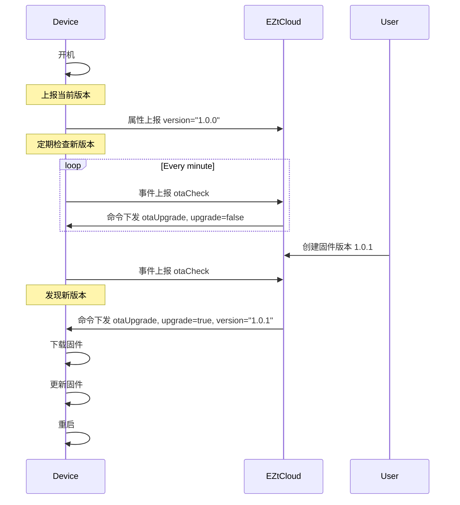
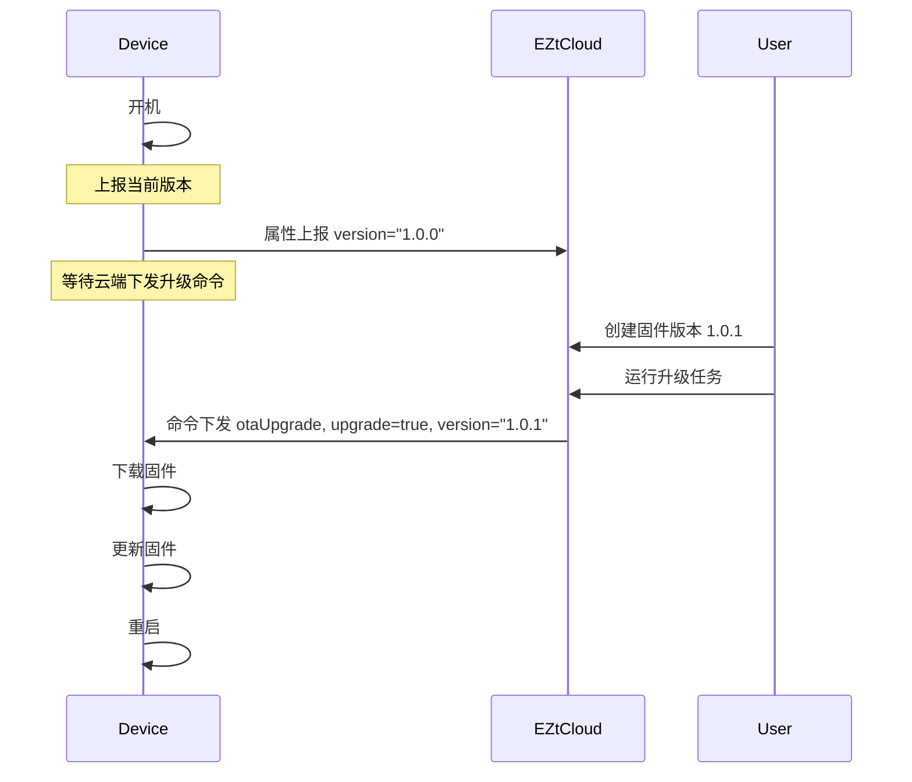

# OTA固件升级

## 什么是OTA？

OTA 的全称是 Over-the-Air Technology，即空中升级技术，也就是我们通常说的远程升级，在物联网硬件中特指对固件或系统的升级，有时也称为 FOTA，即 Firmware OTA。

## EZtCloud OTA 有哪些特性？

- 版本号支持格式多样化，云平台提供版本号检查，设备端无需任何计算。
- 支持设备轮询升级检查（Poll）和云端推送升级（Push）两种模式。
- 支持云端批量升级同一设备类型下的多台设备。
- 支持云端定时推送升级任务到指定设备或所有设备。
- 可指定一个或多个待升级设备，适用于灰度升级和局部调试。
- 可指定待升级版本和目标版本，适用于差分升级。
- 提供升级包 md5 等校验计算。
- 固件下载支持 http/https 可选。

## OTA 固件版本管理

EZtCloud 提供了独立的固件托管服务，您只需创建固件版本，并上传固件包。

### 创建固件版本

进入 **维护 > OTA 版本 > 创建 OTA 版本**，填写如下内容：


- 版本名称：给固件版本起一个任意的名称。
- 设备类型：选择需要升级的设备所属设备类型。固件版本对设备类型下的所有设备有效。
- 版本号：支持通用的版本号命名方式，例如：`1.0.0`
- 模块：用于表示该固件属于哪个模块，默认为 `main`，即硬件的主模块。当硬件中有多个需要升级的模块时，可使用不同的模块名称来创建固件。
- 是否指定待升级设备：如果不指定待升级设备，则默认该固件版本对设备类型下所有设备有效。
    
    使用该功能，可对新固件限定小范围升级，从而验证升级可靠性。另外，也可以根据也许的需要，实现 *灰度升级*。
    
- 是否指定待升级版本：如果不指定待升级版本，则默认该固件版本对设备类型下所有版本的设备有效。
    
    当进行 *差分升级* 时，需要特别约定固件升级前后的版本，适合使用该功能。
    
- 上传固件：支持文件格式包括：`.bin,.img,.dav,.tar,.gz,.zip,.gzip,.apk,.tar.gz`。
- 固件下载地址使用 HTTPS：这里的设置决定了云平台下发给设备的升级命令消息中，固件下载地址是否使用 HTTPS。对于不支持 HTTPS 访问的单片机，可以关闭该选项，使用普通的 HTTP 下载地址。

### 编辑固件版本

固件版本创建后，支持以下编辑操作：

- 启用/禁用：固件版本被禁用后，则不会被云平台用在新版本检查中，可用于版本临时测试或回滚等场景。
- 编辑指定升级的设备
- 编辑指定升级的版本
- 编辑是否支持 HTTPS
- 移除固件版本

> **💡 提示**
>
> 固件版本创建后，不支持重新上传固件包，以确保版本和固件包的一致性，避免引起不必要的混淆。如需上传新的固件包，请创建新的固件版本。

## 设备上报固件当前版本号

在设备进行 OTA 升级之前，云平台需要知道设备当前固件的版本号，从而为每个设备计算是否需要升级，以及需要升级到哪个新版本。

设备上报固件当前版本号，需要通过 MQTT 接入云平台，通过简单的属性上报，即可上报当前版本号。

下边是一个属性上报的例子，代表版本的属性标识符为 `version` ，实际上您可以使用任意标识符，比如： `mcu_version` 、 `gps_version` 。

```json
{
  "version": "1.0.0"
}
```

通常，设备应该在每次上电开机，并成功连接云平台后，首先上报当前版本。

## OTA升级方式

EZtCloud 云平台支持两种OTA升级方式：

- 设备端定期检查新版本
- 云平台推送新版本

## 设备端定期检查新版本

由设备端定期向云平台发起检查新版本的请求，云平台回应设备是否存在新版本需要升级。序列图如下：



### 创建OTA事件规则

设备向云平台请求新版本的过程，是借助事件上报消息来实现的。

我们需要创建一个事件上报的规则，来实现 OTA 升级检查。

进入 **规则 > 创建规则** ，填写如下内容：

- 规则名称：起一个规则名称，例如：OTA 升级检查。
- 规则类型：选择 **事件上报**。
- 设备来源类型：选择 **设备类型**
- 选择来源：选择您需要 OTA 升级的设备所属的设备类型。
- 事件名称：输入 `otaCheck`，也可以使用其它您喜欢的标识符，只要和随后事件消息中的标识符一致即可。

如图：


随后给事件规则添加操作，选择**OTA升级检查**，如下图：


在弹出的设置窗口中，填写如下：


- 版本属性：填写属性上报时，代表版本的属性标识符，这里是 `version`。
- 模块：填写创建固件版本时对应的模块名称，默认是 `main`。

事件规则创建完成。

### 设备上报事件消息

接下来，就可以在设备端通过 MQTT 协议向云平台发送事件上报消息，如下：

```json
{
  "method": "otaCheck",
  "params": {}
}
```

### 设备接收命令消息

云平台收到设备上报的事件消息后，会立即在 OTA 固件版本库中查找是否有符合的新版本，如果存在新版本，则下发包含新版本信息的命令消息，例如：

```json
{
  "method": "otaUpgrade",
  "params": {
    "module": "main",
    "upgrade": true,
    "version": "1.1.5",
    "url": "http://xxx.com/xxx/xxx.bin",
    "size": 1363713,
    "md5": "481701fa4093499eacd05b57bebc7ffc"
  },
  "command_name": "OTA升级",
  "id": 98310
}
```

## 云平台推送新版本

另一种 OTA 升级方式是由云平台主动推送包含新版本固件信息的消息给设备端，设备端收到消息后下载固件并完成升级。

这种方式和前一种方式的区别，主要在于不需要设备端主动上报事件来检查新版本，而是由工作人员手动触发或应用端调用 API 来推送包含新版本信息的命令消息给设备端。

序列图如下：



通过云平台主动推送新版本给设备，是通过 **任务** 来实现的。云平台提供了 OTA 升级推送的任务类型，该任务会对运行的目标设备进行版本对比检查，如果版本库中存在新版本可升级，则下发命令消息给设备。

> **💡 提示**
>
> 当设备不存在可升级的新版本时，OTA 升级推送任务不会下发任何命令给设备。

### 创建OTA升级推送任务

进入 **任务 > 创建任务**，填写如下内容：


- 任务名称：起一个任务名称，例如：OTA 升级任务
- 目标类型：选择设备类型
- 选择目标：选择需要 OTA 升级的设备所属的设备类型。
- 任务类型：选择命令下发
- 选择任务：选择 **OTA 升级推送**
- 定时方式：可选择单次定时，也可根据需要选择相应的定时策略。

在 **OTA 升级推送** 的配置窗口中，类似事件规则的填写：

- 版本属性：填写属性上报时，代表版本的属性标识符，这里是 `version`。
- 模块：填写创建固件版本时对应的模块名称，默认是 `main`。

任务创建完成。

### 运行OTA升级推送任务

进入项目的 **任务** 或当前设备类型的 **任务**，可以看到刚刚创建的任务，点击运行图标，可手动触发运行任务。


这里可以选择对设备类型下所有设备运行升级推送任务，或者指定一个或多个设备运行该任务。

### 设备端接收命令消息

这里和设备主动请求新版本时的下发命令完全相同，可参考：[设备接收命令消息](#设备接收命令消息)。

## 网关子设备的固件升级

OTA 固件升级功能不仅可用于直连设备（也包括网关本身），还可以用于网关子设备。只需为子设备建立前边提到的相关规则和任务，并为子设备的设备类型创建固件版本信息。

例如，我们为子设备类型创建了事件规则，绑定在子设备的 `otaCheck` 事件。如下图：


> **💡 提示**
>
> 在设备上报事件检查固件新版本之前，别忘了先通过属性上报，来上报子设备的当前版本号。详细介绍请浏览[设备上报固件当前版本号](#设备上报固件当前版本号)。

接下来，网关上报子设备的事件，用来检查该子设备是否有新的固件版本可以升级，上报的消息如下：

```json
{
  "device": "DEVICE1",
  "event": { "method": "otaCheck", "params": {}, "id": 1000 }
}
```

在 MQTTX中模拟，如下图：


如果存在新的固件版本，网关会马上收到云平台下发的 OTA 升级推送命令，如下图：

