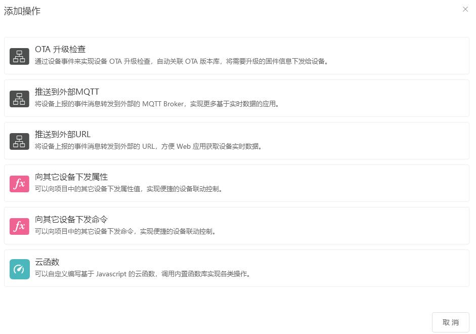
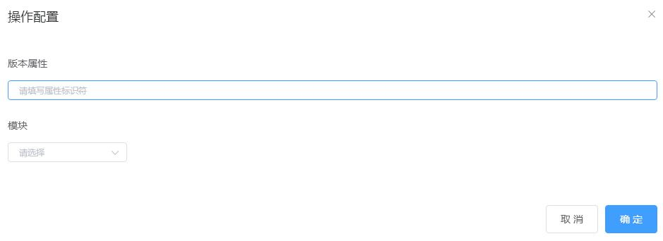
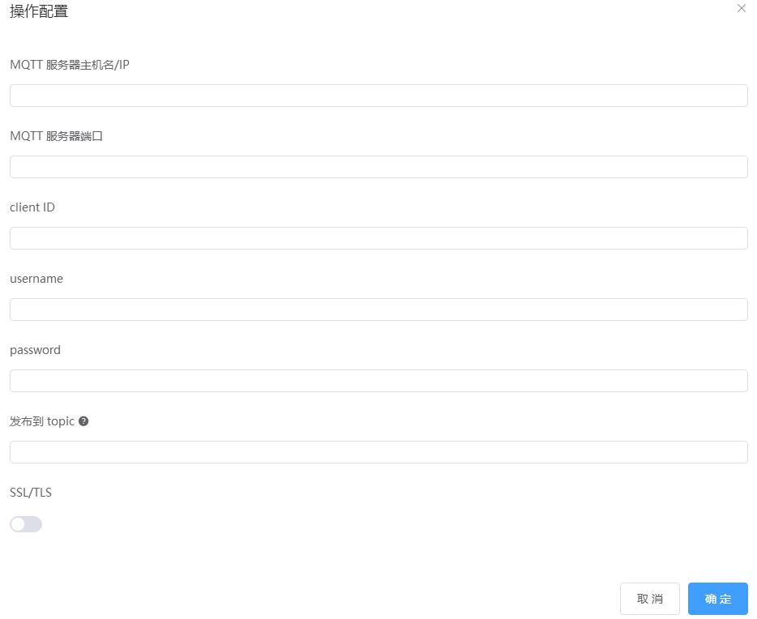
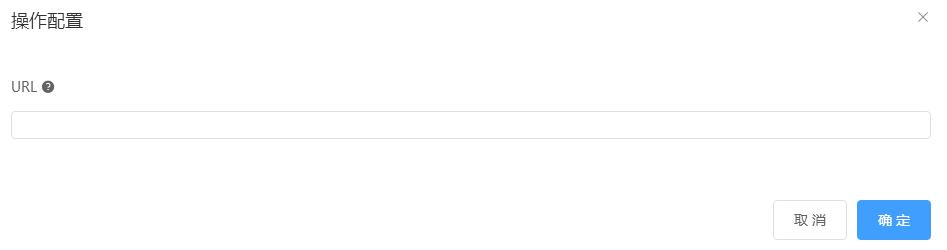
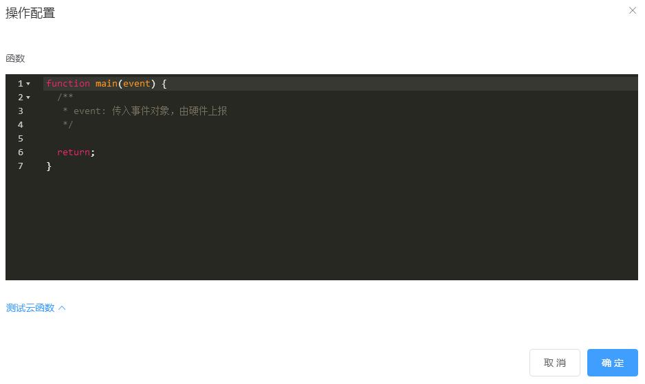
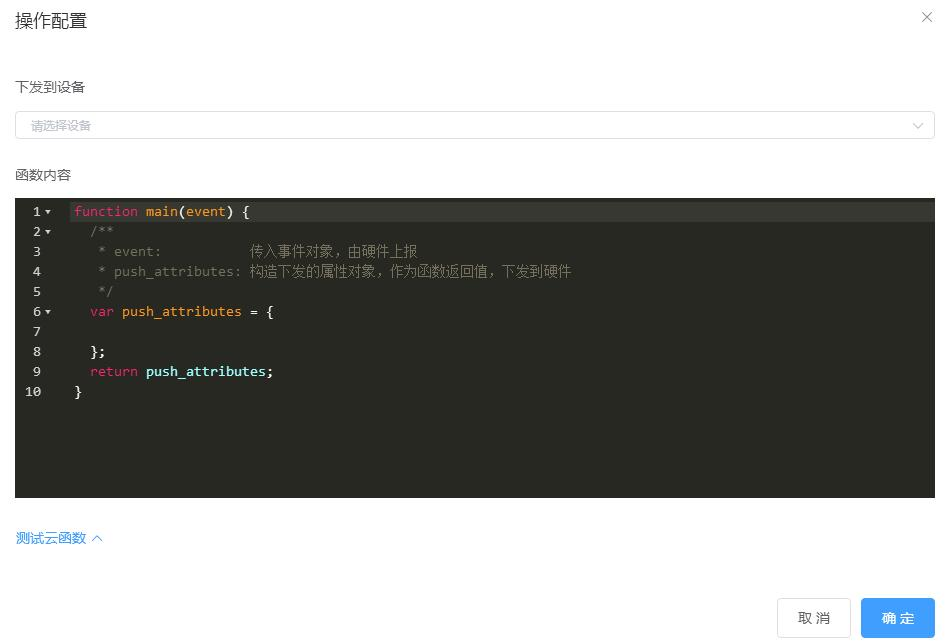
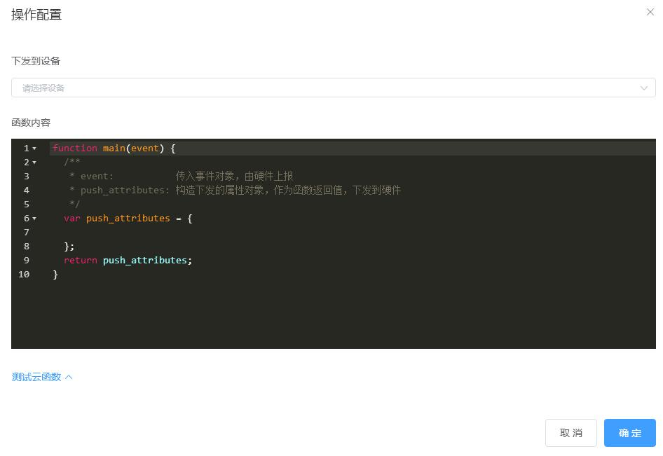

# 事件上报

## 事件上报规则

当云平台接收设备端的事件上报消息后，会触发该类规则。



## OTA检查升级

用于设备OTA固件升级时，由设备请求检查固件新版本。详细说明请查看 [OTA固件升级](OTA固件升级.md)



## 推送到外部MQTT

该操作将设备上报的事件消息直接转发到第三方MQTT服务器，需要填写 MQTT 主机名、端口、身份验证信息等。



## 推送到外部URL

该操作将设备上报的事件消息，通过HTTP请求转发到您设置的第三方URL。



### 请求格式

HTTP请求头

Content-Type: application/json

HTTP正文

采用 JSON 格式，数据示例如下：

```json
{ 
  "device": {    
    // 设备基础信息   
    "id": "string",  
    "name": "string",
    "device_key": "string"
  },
  "event": {      
    // 设备上报的事件
    "method": "string",
    "params": { 
        // ...   
    },    
    "id": number
  },
  // 当前 Unixstamp 时间戳
  "ts": number
}
```

## 云函数



除了各类专用的操作组件外，云平台面向企业客户提供通用的 云函数，支持比较大的自由度，可以自定义处理逻辑，并支持一些内置函数，例如：

- 更新设备云端私有属性
- 给指定设备下发属性
- 给指定设备下发命令

## 向其他设备下发命令

该操作用于向其它设备下发命令，实现设备联动功能。

设备来源类型为：设备



参数

- event：是当前设备上报的事件消息。

返回值

- object 类型：构造一个下发到目标设备的命令消息。
- null：表示不下发命令到设备。

### 向其他设备下发属性

该操作用于向其它设备下发属性，实现设备联动功能。

设备来源类型为：设备



当前设备上报的事件消息，会作为 event 参数传入下发属性的构造函数，您可以编写一定的逻辑，来构造下发到其它设备的属性 attributes。

例如，当前设备上报的事件消息为：

```json
{
  "method": "switchRelay",
  "param": {
    "state1": true,
    "state2": false
  }
}
```

该操作的属性下发函数：

```jsx
function main(event) {
  var push_attributes = {
    relay1_state: event.params.state1 || false,
    relay2_state: event.params.state2 || false,
  };
  return push_attributes;
}
```

将事件参数中的字段直接复制到下发的属性消息中，非常简单。更加复杂的场景以此类推即可。

参数

- event：是当前设备上报的事件消息。

返回值

- object 类型：构造一个下发到目标设备的命令消息。
- null：表示不下发命令到设备。

提示：

关于如何在设备上接收属性下发，请浏览**设备MQTT标准协议接入＞云端下发属性**