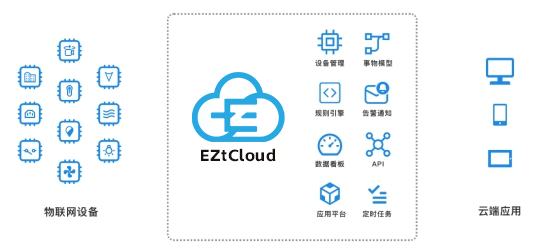

# EZtCloud是什么？

EZtCloud是物联网设备统一接入平台，EZtCloud可接入各类网关，传感器、执行器、控制器、智能硬件等，实现数据采集、远程控制，数据分析、告警通知、智能联动。同时还开放API和实时消息，能够和其它系统集成对接。

通过使用EZtCloud，企业可以大大缩短搭建物联网系统的时间，节省软件开发费用，降低定制开发的风险，快速落地数字化和智能化项目。

EZtCloud既可以配合传感器、网关、DTU等设备快速搭建一套数据采集方案，也可以帮助智能硬件接入云端实现远程控制或设备联动等功能，还可以与多种硬件结合实现物联网行业解决方案，并为物联网应用提供了无限可能。

EZtCloud的用户遍布多个行业和应用场景，包括但不限于：

- 工业物联网
- 智慧能源
- 智能制造
- 智能家居
- 智慧农业
- 智能养殖
- 智慧楼宇
- 智慧园区
- 智慧物流
- 智慧城市
- 资产管理
