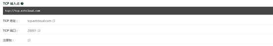
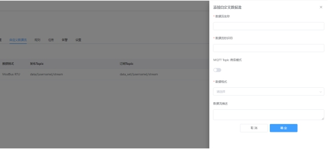
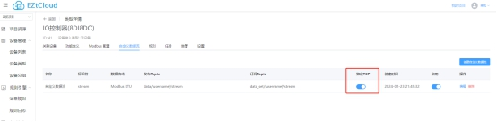

# 设备TCP接入协议

平台支持设备直接通过TCP接入云平台，并支持 JSON、Text、HEX 格式的上下行消息，为设备通信提供了无限的可能性。

## TCP接入点

在设备详情的【连接】页面中，可以获取设备专用的TCP接入点，设备必须支持域名解析，格式如下：

## TCP注册包

当设备和云平台成功建立TCP连接后，设备必须马上向云平台发送注册包，完成身份认证。若设备端在一定时间内未发送身份信息，云平台会自动断开设备的TCP连接。

在使用TCP透传方式的网关或DTU中，可以使用注册包连接到云平台。

请注意，当设备通过注册包完成身份认证，有其它设备通过相同身份信息连接云平台，会自动顶掉之前的设备连接。

## TCP心跳包

当设备和云平台建立TCP连接并完成身份认证后，便可以相互收发消息。但是，如果相当长一段时间内没有消息通信，双方如何判断对方仍然在线呢？因为TCP 对于一些非正常的连接断开是无法侦测到的，比如设备断电、网线断掉等。

因此，对于消息通信间隔较长的应用场景，为了让双方尽早的知道连接是否已经断开，从而实现重连，就需要有TCP保活机制，这是通过设备定期发送心跳包来实现的。

然而，大多数物联网通信场景的数据上报间隔时间并不长，所以也可以起到保活的目的，心跳包不是必须的。

## 自定义数据流

平台提供的TCP接入方式，不像MQTT一样拥有一套内置的设备访问协议，而是需要对***TCP通道所属的自定义数据流***，设置相应的消息规则，实现自定义数据和设备属性之间的解析和处理。

1. 创建设备类型

要开启自定义数据流，首先要创建设备类型。设备类型是用来统一定义设备的属性和功能。

在【设备类型】中可以创建设备类型，进入创建好的设备类型，在【关联设备】页面中，将设备添加到设备类型中，相当于为设备赋予了设备类型中定义的属性和功能。

1. 创建自定义数据流

在【自定义数据流】页面中，可以创建自定义数据流，如下：

自定义数据流自动生成了相应的MQTT发布主题和订阅主题，并允许设置数据格式，例如 Modbus RTU、自定义HEX、自定义ASCII、JSON 等。

1. 绑定TCP数据流

而对于TCP连接，我们只需要选择一个已创建的自定义数据流，进行绑定即可。

也就是说，被绑定的自定义数据流，同时也具备了TCP通道。

1. TCP自定义数据上报

完成上边的TCP绑定自定义数据流，设备端就可以通过TCP socket发送符合负载格式的数据，例如：类似属性消息结构的 JSON 消息，或者自定义的 HEX 消息。

平台收到TCP自定义数据上报后，可以创建规则引擎来对数据做各种解析和处理，平台提供了云函数等可编程方式，也可以将数据转发给第三方的 WebHook URL，进行其它专用的异步计算。

1. TCP自定义数据下发

要向已通过TCP连接到云平台的设备下发自定义数据，可以通过如下方式：

- 通过***创建任务>自定义数据下发***
- 通过***创建规则>属性下发>自定义数据下发函数***