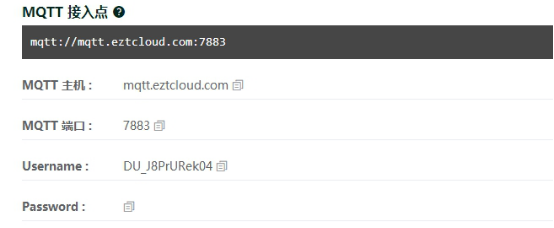

# 设备接入协议

设备和云平台如何交换数据，这就涉及到设备和云平台的接入通信协议。

这一节，将简要介绍云平台支持的设备接入协议，帮您对这些方式有一个总体的了解，并大概知道如何选择它们。每一种接入方式的具体原理和操作方式，我们将在后续的相关章节中详细说明。

## MQTT协议

MQTT 是物联网领域常见的通讯协议。在通过 MQTT 接入时，设备需要和云平台建立 TCP 长连接，并通过 MQTT 协议特有的方式完成身份认证。当设备成功连接到云平台后，通过发布（Publish）和订阅（Subscribe）相应的主题（Topic），来完成与云平台的消息通信。

若采用 MQTT 方式接入，设备首先要和云平台建立 MQTT 连接，您可在**设备详情页**的**连接**tab页找到 MQTT 连接的主机地址、端口号、Username 和 Password，如图：

当设备与云平台成功连接 MQTT 后，设备就可以按照 [设备MQTT接入协议](设备MQTT接入协议.md) ****收发数据。

对于子设备通过父设备接入云平台的场景，父设备可按照 [子设备MQTT接入协议](子设备MQTT接入协议.md) 向平台收发其子设备数据。

注意到，[一级子设备MQTT接入协议](一级子设备MQTT接入协议.md) 作为 [子设备MQTT接入协议](子设备MQTT接入协议.md) 的一个子集，已不推荐使用，所有新接入设备应优先考虑使用后者。

EZtCloud作为物联网PaaS云平台，对设备 MQTT 接入提供了内置的访问协议规范，让设备和云平台的消息通信更加有章可循，大大简化了物联网项目的开发难度，缩短了产品的开发周期。

不同于普通的 MQTT 使用方式，我们提供了标准的内置主题，这足以实现绝大多数的物联网应用场景。

而对于另一些个性化的消息通信场景，我们也提供了灵活的自定义主题，您可以创建自己的主题，并配合包括云函数在内的规则引擎，实现任何消息通信需求。

---

***注意**：全局的，除 [自定义数据流](../设备类型/自定义数据流.md) 外，所有 MQTT 负载消息都必须是 JSON 格式，如果发布的不是 JSON 格式，设备会被平台主动断开 MQTT 连接。*

---

## HTTP协议

在很多数据采集的单一场景中，HTTP是一种相对简单可靠的应用层协议，它工作在TCP/IP协议栈上，具有很好的易用性和强大的基础库支持，对开发者来说很容易快速上手。

HTTP接入协议很适合单纯的数据采集场景，不需要对设备下发实时消息。设备如果有丰富的资源，还可以使用更加安全的 HTTPs 实现加密传输。

## COAP协议

CoAP由于不需要和云平台建立 TCP 连接，所以设备用于网络通信的开销相对比较低，很适合用在低功耗设备，例如：需要依赖电池常年工作的智能水表。

## TCP协议

除此之外，平台还支持TCP接入协议，在控制台可以设置基于TCP的自定义数据格式，支持 ASCII 、HEX、JSON 等格式。

常用的通讯设备DTU，通常都支持 TCP 透传方式接入云平台。