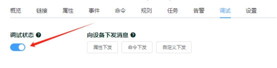
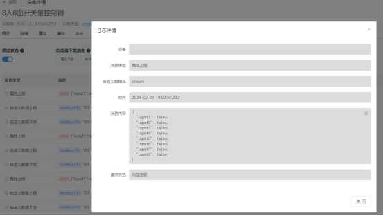
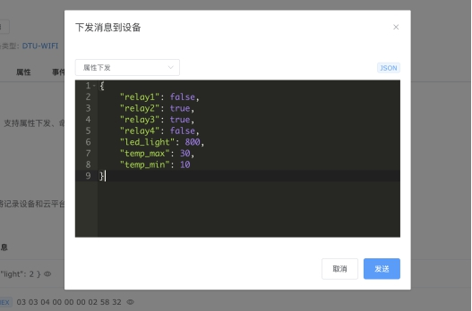
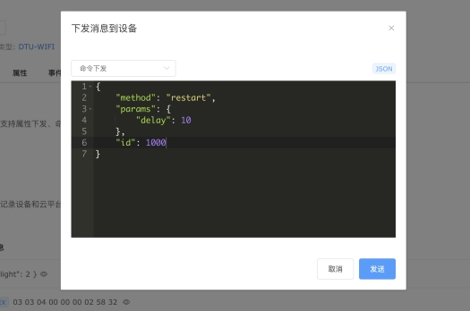
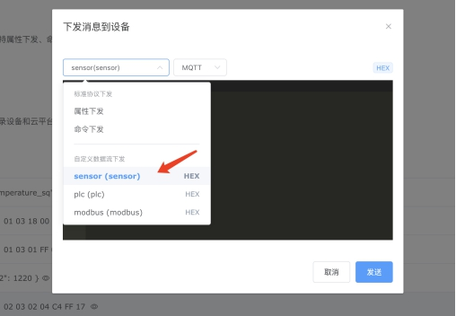
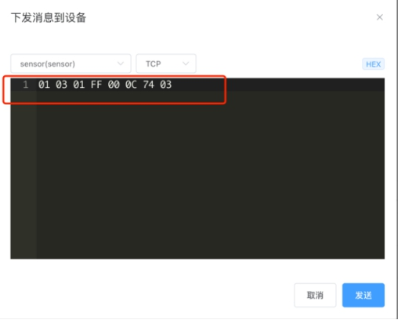
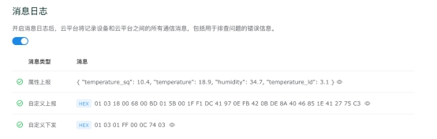

# 设备消息调试

平台为您提供了快捷的设备消息调试界面，可以帮助您：

- 实时监视设备和云平台之间双向传输的所有消息，支持 JSON、Plaintext、HEX 等格式。
- 查看消息格式错误的提示信息。
- 向设备下发消息，包括：下发属性、下发命令、下发自定义数据。

这些消息包括设备发送给云平台的消息，以及云平台下发给设备的消息。设备和云平台之间的所有互动都体现在消息中，所以，通过监视设备消息，可以帮助您快速定位和排查设备和云平台的通信是否符合预期。

## 开启消息日志

要查看这些消息，首先需要开启设备的消息日志，如下图：

每个消息可以点击右侧的图标，查看消息详情，如下图：

平台不仅支持JSON消息格式，还支持二进制和Plaintext 格式，例如 RS485/Modbus RTU消息是二进制格式。

## 查看错误信息

通过消息日志，还可以监视消息格式错误的原因，帮助您排查问题。

例如，如果您在设备类型中添加了属性定义，但设备上报的属性值不符合该属性定义时，云平台会拒绝接收消息，并产生错误信息。

## 向设备下发消息

设备调试界面中，可以快速为设备下发各类消息，可用于协议调试和设备故障排查。

1. 下发属性

1. 下发命令

1. 下发自定义数据

在设备类型中添加自定义数据流

这样，我们在设备调试界面就可以选择自定义数据流，作为下发消息的通道。

这里我们为接入的DTU设备下发一个Modbus RTU查询指令，使用 HEX 消息格式。

DTU将指令透传到RS485串口总线，获得传感器的回复消息，同时解析为传感器属性 JSON，进入设备属性。

利用HEX 下发消息调试功能，还可以在设备安装部署时快捷执行一些一次性的指令，例如修改设备Modbus从机站号、对设备初始化配置等。

