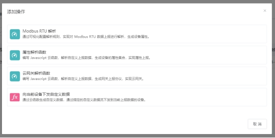

# 设备通过DTU接入

DTU是Data Transfer Unit的简称，也就是数据传输单元。DTU是一种典型的网关产品，它的特点在于面向用户的快速配置能力，部分DTU还支持可编程。DTU将应用到更多的物联网场景中，成为一种开箱即用的硬件网关。

设备通过DTU接入平台时，并不需要编程知识，更多是基于配置界面来设置平台接入参数，以及和子设备的通信参数。

平台适配各类DTU产品，为物联网应用开发带来快速接入体验。

## EZtCloud支持的DTU接入协议

- MQTT
- TCP

## DTU通过MQTT方式接入云平台

对于支持MQTT的DTU产品，只需要简单几步就可以接入平台。

### 1.创建设备类型

- 创建一个设备类型，填写以下信息：
- 创建设备类型：选择自定义类型
- 类型名称：起个名字，例如：我的DTU
- 设备接入类型：直连设备
- 设备通讯方式：根据DUT联网方式
- 设备接入协议：选择Modbus RTU透传

### 2.创建自定义数据流

- 数据流名称：起个名称，例如：自定义数据流
- 数据流标识符：例如：modbus
- 数据格式：选择正确的数据流格式，例如：Modbus RTU格式

参考：[自定义数据流](自定义数据流.md)。

### 3.创建设备

- 设备名称：起个设备名字，例如，我的DTU_01
- 设备类型：选择刚刚创建的设备类型，例如：我的DTU

### 4.获得设备MQTT连接参数

进入创建好的设备详情页，在【连接】页面中，找到用于MQTT连接的一些重要信息，包括：

- MQTT主机
- MQTT端口
- Username
- Password

### 5.配置DTU连接到云平台

不同的DTU产品支持不同的配置方式，通常有***上位机软件***和 ***Web界面***等方式。

不论是哪种配置方式，都可以找到MQTT连接参数的配置界面，完成MQTT连接参数配置后，可以先保存DTU配置，这一步我们已经完成了DTU和云平台连接的身份认证配置。

### 6.使用MQTT自定义主题

每个自定义数据流会生成一组MQTT主题，包括一个发布主题和一个订阅主题，用来实现设备上报数据给平台，以及接收平台下发的数据，例如，我们创建一个标识符为modbus的自定义数据流，设置为支持 Modbus RTU 数据格式，那么平台会自动生成如下主题：

| ***功能*** | ***类型*** | ***主题*** |
| --- | --- | --- |
| 上报数据 | 发布 | data/modbus/{username} |
| 下发数据 | 订阅 | data_set/modbus/{username} |

在实际使用中，以上这两个MQTT主题，可以实现平台向设备下发Modbus查询指令，设备向平台上报Modbus指令。平台通过设备类型中的Modbus寄存器设置或消息规则，来自动解析Modbus指令，提取相应的数据，自动生成设备属性。

### 7.配置DTU连接子设备

当我们完成以上配置后，如果DTU本身存在设备数据，例如DTU自身的版本信息，或者DTU本身支持IO输入，平台便可以开始接收DTU的真实数据上报。

除此之外，DTU的真正使命是转发其连接的子设备和云平台之间的消息。那么，就需要配置DTU和子设备的连接方式以及数据格式。

具体配置方法请参考DTU和子设备厂家所提供的的相关产品说明。

### 8.使用云平台辅助配置子设备

举个例子，我们在配置支持RS485/Modbus的传感器或IO控制器接入DTU时，由于我们事先已经配置好了DTU和云平台的连接，所以我们可以直接从云平台下发Modbus指令给传感器，完成从机地址修改等基本操作。

我们还可以用这种方式来远程调试传感器的数据上报准确性等，总之DTU为云平台和实际设备之间提供了通信桥梁，我们可以充分利用这种便利性。

### 9.使用平台定时任务

当DTU和子设备是主从关系时，我们需要DTU主动定时向子设备发送查询指令，有些DTU支持这样的功能，对于不支持的DTU，再或者我们需要远程灵活的调整查询策略，那么可以使用云平台提供的定时任务功能。

定时任务支持多种丰富的定时策略，例如：按间隔时间、按每日固定时间等。可执行的任务可以是下发一个 JSON 消息给设备，也可以是下发一个Modbus 查询指令，从而触发DTU连接的从机设备上报数据。

### 10.使用云平台规则引擎

同样以RS485/Modbus的传感器设备举例，为了快速解析Modbus协议，平台的规则引擎支持内置的Modbus解析规则，您可以在规则引擎中添加这样的操作，如下图：

规则配置非常简单，您只要略懂Modbus协议，并参考传感器设备的手册，便可以完成Modbus数据的提取。

### 11.注意事项

- 如果DTU默认开启了一些预设主题的订阅，请将其关闭。否则会由于该主题不在平台支持的主题范围内，被平台限制MQTT接入。
- DTU发布数据的时间间隔不要低于30秒，否则可能会被平台断开。

## DTU通过TCP透传方式接入云平台

TCP透传是DTU比较常见的一种平台连接方式，也是几乎所有DTU产品都支持的连接方式。这种方式让DTU作为一种透明转发的工作模式，将子设备发来的消息，直接转发给平台，同时也将平台下发的消息，转发给子设备。

总体来说，如果熟悉了前边的MQTT接入配置方法，那么TCP透传的配置方法基本类似，不同之处在于TCP接入点和设备身份认证的方式。

接下来我们介绍DTU TCP透传方式的接入步骤。

### 1.创建设备类型

- 创建一个设备类型，填写以下信息：
- 创建设备类型：选择自定义类型
- 类型名称：起个名字，例如：我的DTU
- 设备接入类型：直连设备
- 设备通讯方式：根据DUT联网方式
- 设备接入协议：选择Modbus RTU透传

### 2.创建自定义数据流

- 数据流名称：起个名称，例如：自定义数据流
- 数据流标识符：例如：modbus
- 数据格式：选择正确的数据流格式，例如：Modbus RTU格式
- ***绑定TCP数据流：***选择自定义数据流，这相当于为该设备类型下的所有设备，开放了TCP接入通道。至于这里的Topic等信息，我们可以忽略，在使用TCP通道时没有实际作用。

### 3.创建设备

- 设备名称：起个设备名字，例如，我的DTU_01
- 设备类型：选择刚刚创建的设备类型，例如：我的DTU

### 4.获得设备TCP连接参数

进入创建好的设备详情页，在【链接】页面中，找到用于TCP连接的一些重要信息，包括：

- TCP地址
- TCP端口
- 注册包

### 5.配置DTU连接到平台

不同的DTU产品支持不同的配置方式，通常有上位机软件和 Web界面等方式。

不论是哪种配置方式，要配置的内容项基本相同，它们包括：TCP地址、TCP端口、注册包、心跳包(可选，用于设备TCP协议层保活)，完成以上配置后，可以先保存DTU配置。

到目前为止，我们在DTU端已经完成了TCP透传方式连接平台的所有配置。

### 6.数据发送和接受测试

为了测试DTU和平台是否已经通过TCP透传成功连接，可以在***设备详情页 >*** ***调试***中，开启***调试***状态，用于查看设备发送和接收的消息。

常用的测试方法，例如：

用配置DTU的专用上位机软件，将DTU切换到透传模式，然后向DTU发送数据，在平台设备消息列表中刷新，检查是否会显示相应的消息。

同样在DTU的透传模式下，用其它任何串口调试工具，连接到DTU的从机端口，例如：RS485端口，模拟子设备发送消息给DTU，在云平台设备消息列表中刷新，检查是否会显示相应的消息。

### 7.上报DTU子设备的真实数据

最后，我们给DTU接上子设备，例如一个RS485 Modbus温湿度传感器，通过 Modbus RTU任务来定时下发Modbus查询指令，并通过Modbus RTU规则来自动解析Modbus消息，生成设备的属性数据。