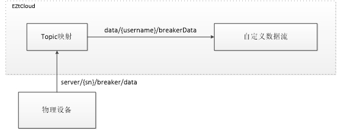
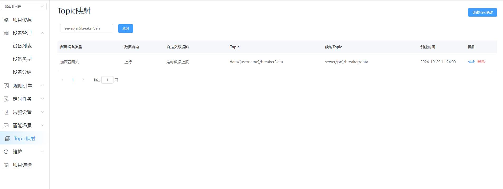

# Topic映射

Topic映射适用于设备无法自定义MQTT topic的场景，需要将设备的topic映射到平台自定义数据流topic上。

举例：某厂商设备不支持配置属性上报topic时，可通过Topic映射功能，将设备上报的数据映射到本系统的自定义数据流的相应topic上。数据流原理图如下所示：

想要实现上图中的功能，只需按如下方式配置一条topic映射即可，如下图所示：

注意：

- 配置映射topic时，“映射topic”必须包含{sn}，它是设备的“序列号”（如下图所示）。
- 需要使用映射topic的设备，都必须配置序列号。

