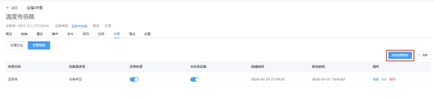
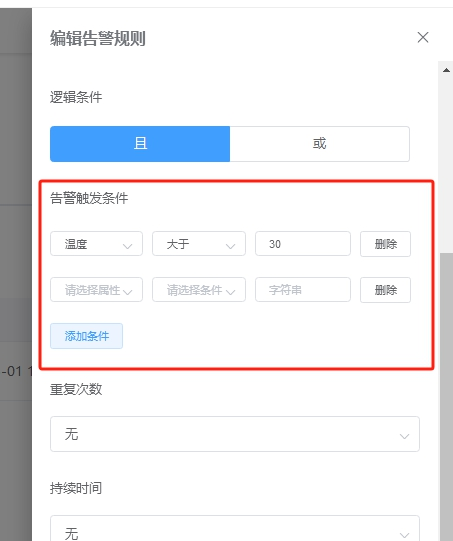
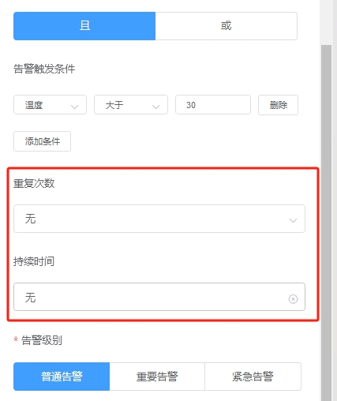
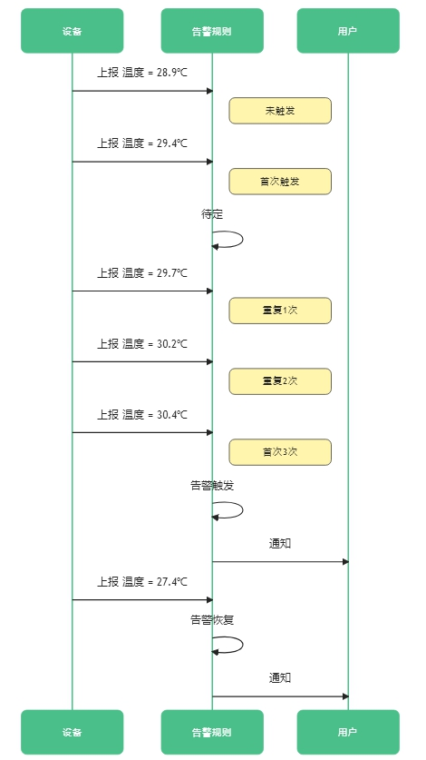
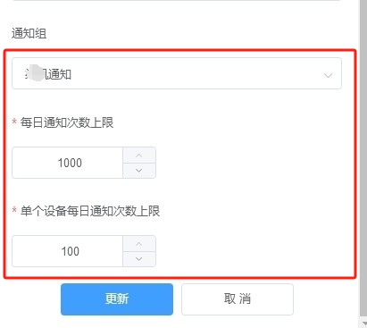

# 告警规则

# 告警规则

EZtCloud提供了内置的告警规则，可以将设备上报属性的变化作为告警触发条件。可以为接入的设备创建灵活的告警规则，从而实现告警通知。

***注：除此之外，依托于开放的 EZtCloud API，也可以在应用端实现任意告警逻辑和通知。***

## 创建规则

可以在***设备详情页>告警>告警规则***中，为当前设备创建告警规则。例如：

也可以在***设备类型详情页>告警***中，为当前设备类型创建告警规则。

以上两种方式的区别是设备源的不同，设备源决定了告警规则的作用范围，也就是对哪些设备有效。

## 告警规则的设备源

告警规则支持两种设备源类型：

- 设备类型：告警规则的作用范围包括设备类型下的所有设备。例如：设备源选择燃气浓度传感器设备类型，那么该类型下的所有燃气浓度传感器设备，都可使用该告警规则，而无需为每个设备重复创建告警规则。
- 设备：告警规则的作用范围仅针对指定的一个或多个设备。

## 告警触发条件

触发条件是告警规则中的重要部分，这里支持设置多个属性触发条件。如下图：

## 设置多个触发条件

当设置多个属性触发条件时，请注意逻辑关系，您可以设置 ***且*** 或者 ***或***。

- 且：表示多个条件要同时成立才会触发，例如：当湿度大于50% 并且温度大于 20℃时触发告警。
- 或：表示多个条件只要有一个成立即可触发，例如：当湿度大于50%或温度大于 20℃时触发告警。

## 重复次数和持续时间

在满足触发条件的同时，还支持设置重复次数和持续时间。

- 重复次数：设置重复次数后，告警条件首次触发时不会进入告警状态，也不会发送告警通知。当告警条件连续重复触发该次数后，进入告警状态并发送告警通知。
- 持续时间：设置持续时间后，系统会在告警条件被连续触发达到该持续时间后，进入告警状态。

**注意：当重复次数和持续时间同时设置时，两者必须同时满足，设备才会进入告警状态。**

举个例子：告警规则设置如下：

触发条件是温度大于 29℃

重复次数是 3 次

时序图如下：

## 告警级别

告警级别用来区分告警的重要级别，用在告警历史和告警通知的显示文字中。例如，在邮件通知方式中，告警级别会显示在邮件标题中。

可选的告警级别包括：

- 普通告警
- 重要告警
- 紧急告警

## 通知组

将已创建的通知组加入告警规则中，用于发送告警通知。支持设置多个通知组。为了防止频繁通知造成不必要消耗，平台限值了对每日通知次数上限(默认最大值1000)和单个设备每日通知次数上限(默认最大值100)

关于通知组的详细介绍，请浏览[告警通知](告警通知.md)

## 告警规则的可用状态

- 全局可用状态：每个告警规则可设置全局可用状态，用来启用或禁用该规则，对该告警规则的所有设备源都生效。
- 单个设备可用状态：在全局可用状态开启的情况上，您可以对关联的设备独立设置启用或禁用状态。例如，当对某个设备进行维护时，可临时关闭该设备的告警规则，但不影响告警规则关联的其它设备。

## 告警规则的告警状态

告警规则拥有以下几种的告警状态：

- 告警（Alerting）：表示最近一次设备属性上报已触发告警规则，且达到设置的重复次数和持续时间。如果未设置重复次数和持续时间，则首次触发会进入告警状态。
- 待定（Pending）：表示最近一次设备属性上报已触发告警规则，但未达到设置的重复次数和持续时间。
- 恢复（Restore）：表示曾经触发了告警和待定，最近一次设备属性上报未触发告警规则。