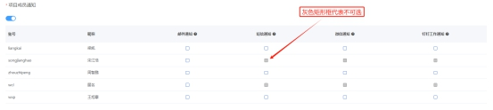
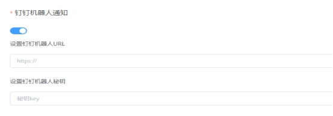
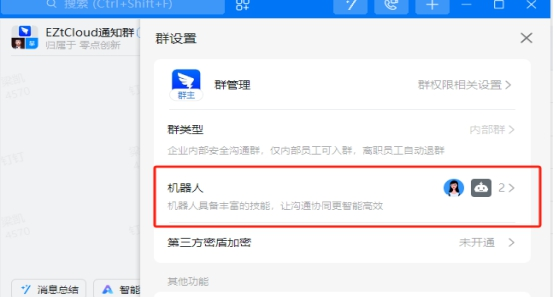
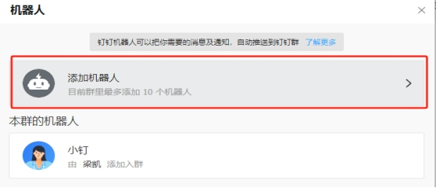
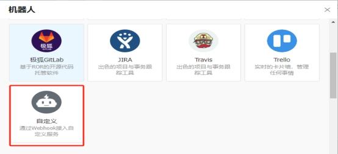
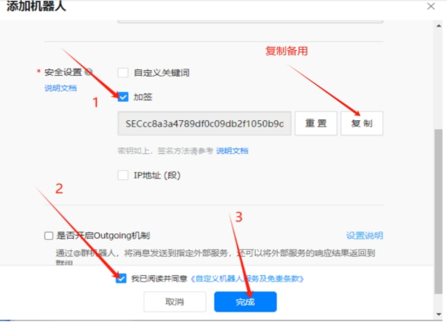
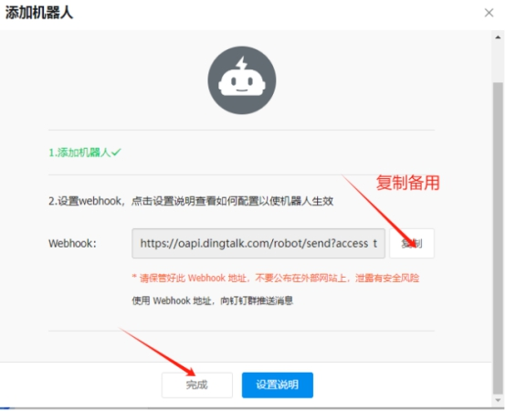

# 告警通知

# 告警通知

EZtCloud提供了内置的告警通知方式，包括：

- 邮件
- 短信
- 电话
- 微信公众号
- 钉钉群机器人

要使用这些通知方式，我们需要创建通知组。

## 创建通知组

进入***告警设置 > 通知组 > 创建通知组***，即可快速创建通知组。

在创建过程中，选择您需要的通知方式，一个通知组可以选择多个通知方式。

### 选择通知方式

### 项目成员通知(项目设置>项目成员)

可以快速对项目成员开启以下通知方式：

- 邮箱通知：使用EZtCloud注册邮箱。
- 微信公众号通知：面向已完成微信公众号绑定的项目成员。
- 短信通知：面向完成手机号认证的项目成员。
- 钉钉工作通知：面向加入钉钉虚拟组织的项目成员。

### 钉钉机器人通知

需要填写钉钉群机器人Webhook地址和钉钉机器人秘钥

获取钉钉群Webhook地址和钉钉机器人秘钥步骤如下：

***群设置>添加机器人>自定义>添加>加签>完成***

添加机器人：

自定义：

加签：

完成：

