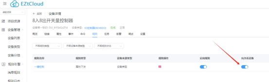

# 创建规则引擎

# 什么是规则

规则引擎在EZtCloud中发挥着重要的作用，它可以按照设定的条件，对设备和平台之间传递的消息进行各种计算、处理、流转等操作。

例如用规则可以实现以下场景：

- 对设备上报的原始数据进行处理，生成我们需要的最终数据，保存在设备属性中。
- 将设备上报的属性，直接转发到第三方MQTT服务器。
- 将设备上报的事件，直接转发到第三方HTTP API接口。
- 当设备上报属性达到某个条件时，向另一个设备下发属性或命令。
- 当设备上报事件时，向另一个设备下发属性或命令。
- 对设备上报的Modbus RTU二进制消息进行解析，生成相应的设备属性。
- 对设备上报的非标准二进制协议，进行任意的解析，生成相应的设备属性。
- 向设备下发开关量属性时，自动生成设备能够识别的二进制报文。
- 向设备下发数值参数时，自动生成设备能识别的二进制报文。

## 创建规则

创建规则需要了解以下基本概念：

## 1) 规则类型

规则类型决定了规则的触发时间点，目前包括以下类型：

- 属性上报预处理：在云平台接收到设备端上报的属性后，且更新设备属性前，触发该类规则。
- 属性上报：在云平台正式更新设备属性后，触发该类规则。
- 事件上报：在云平台收到设备事件上报后，触发该类规则。
- 属性下发预处理：在云平台将要向设备端下发属性时，触发该类规则。
- 属性下发：在云平台向设备端下发属性后，触发该类规则。
- 自定义上报：在云平台收到设备自定义数据上报后，触发该类规则。

### 2) 设备来源类型

- 设备：将规则的作用范围限定在指定的一个或多个设备。
- 设备类型：将规则的作用范围限定在设备类型下的所有设备。

因此，如果只想对某个或某几个设备定义规则，则选择设备作为来源类型；如果希望对设备类型下的所有设备都定义同样的规则，则选择设备类型作为来源类型。

### 3) 属性条件

当规则类型是属性上报预处理或属性上报 时，可以设置条件，条件设置不是必须的，当设置条件后，只有当上报的属性符合该条件时，才会触发该规则。

### 4) 事件标识符

当规则类型是事件上报时，需要设置事件标识符。只有当设备上报的事件符合时，才会触发该规则。

### 5) 自定义数据流标识符

当规则类型是自定义上报时，需要设置自定义数据流标识符。只有当设备上报的自定义数据符合时，才会触发该规则。

### 6) 操作

操作是规则中的重要组成部分，一个规则被触发后，实际上执行的是预先设定好的操作部分。

添加操作：每类操作都是一个独立的组件，在后边章节中，会针对不同类型的规则，详解介绍如何使用各类操作。

操作排序：一个规则中允许有多个操作，操作的顺序决定了执行的顺序。

对于属性上报预处理类型的规则，每个操作都是同步执行，多个操作是串行执行，也就是前一个操作生成的属性集合，是下一个操作的属性输入。

而对于其它类型的规则，操作大多是异步执行，因此操作的顺序对运行结果并没有直接影响。

## 规则状态

每个规则拥有独立的状态，分为：

- 已启用：规则可被触发。
- 已停用：规则被忽略。

与此同时，规则还可以对其作用范围内的每个设备单独设置是否有效。例如：一个规则属于设备类型，规则全局状态是已启用，但是对某个设备可以关闭规则，如下图：

## 规则统计

在***规则详情页 > 统计***以及***设备详情页*** ，都可以查看规则的调用次数统计。

## 规则日志

在***规则详情页 > 日志***中开启调试状态，便可以记录每次规则被触发的日志，便于查看规则是否被触发。