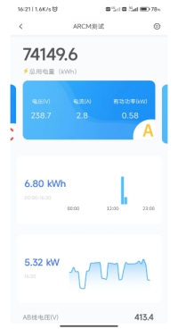
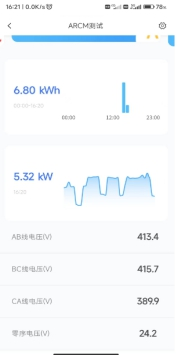
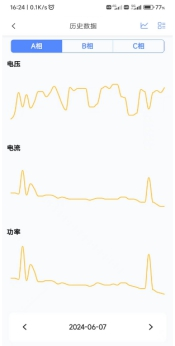
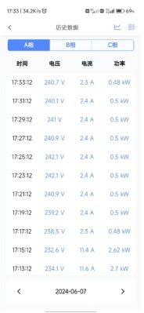
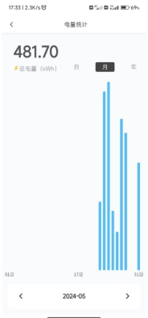
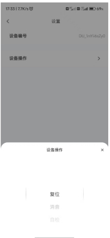
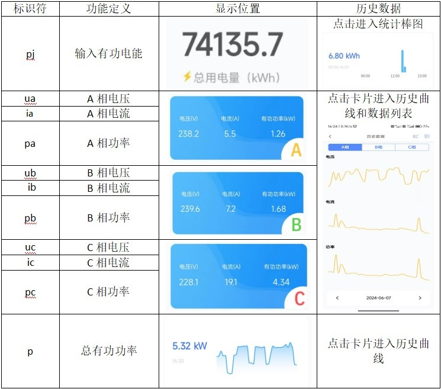

# 个性化UI

# 个性化UI

我们为一些广泛应用的设备类型定义个性化UI，以更好的展示和统计数据。个性化UI通过识别**属性标识符**来确定数据展示的位置。**固定属性标识符，在您创建功能定义时需严格保持一致。**

## 电气仪表

**固定属性标识符**列表,区分大小写：

非固定属性标识符，显示在主界面列表，非必须按照我们规定的标识符，但为了尽可能使标识符规范化，还是将我们采用的标识符列在下表，供您参考：

| 标识符 | 功能定义 | 显示位置 | 历史数据 |
| --- | --- | --- | --- |
| uab | AB线电压 | 设备主界面列表展示 |  |
| ubc | BC线电压 | 设备主界面列表展示 |  |
| uca | CA线电压 | 设备主界面列表展示 |  |
| u0 | 零序电压 | 设备主界面列表展示 |  |
| i0 | 零序电流 | 设备主界面列表展示 |  |
| ma | 剩余电流 | 设备主界面列表展示 |  |
| uunb | 电压不平衡度 | 设备主界面列表展示 |  |
| iunb | 电流不平衡度 | 设备主界面列表展示 |  |
| hz | 频率 | 设备主界面列表展示 |  |
| qa | A相无功功率 | 设备主界面列表展示 |  |
| qb | B相无功功率 | 设备主界面列表展示 |  |
| qc | C相无功功率 | 设备主界面列表展示 |  |
| q | 总无功功率 | 设备主界面列表展示 |  |
| sa | A相视在功率 | 设备主界面列表展示 |  |
| sb | B相视在功率 | 设备主界面列表展示 |  |
| sc | C相视在功率 | 主界面列表展示 |  |
| s | 总视在功率 | 主界面列表展示 |  |
| pfa | A相功率因数 | 主界面列表展示 |  |
| pfb | B相功率因数 | 主界面列表展示 |  |
| pfc | C相功率因数 | 主界面列表展示 |  |
| pf | 总功率因数 | 主界面列表展示 |  |
| t01 | 温度1 | 主界面列表展示 |  |
| t02 | 温度2 | 主界面列表展示 |  |
| t03 | 温度3 | 主界面列表展示 |  |
| t04 | 温度4 | 主界面列表展示 |  |
| epe | 输出有功电能 | 主界面列表展示 |  |
| eqc | 输出无功电能 | 主界面列表展示 |  |
| pjr | 输入无功电能 | 主界面列表展示 |  |
| thdu_ua | A相电压总谐波 | 主界面列表展示 |  |
| thdu_ub | B相电压总谐波 | 主界面列表展示 |  |
| thdu_uc | C相电压总谐波 | 主界面列表展示 |  |
| thdi_ia | A相电流总谐波 | 主界面列表展示 |  |
| thdi_ib | B相电流总谐波 | 主界面列表展示 |  |
| thdi_ic | C相电流总谐波 | 主界面列表展示 |  |
| ….. | ….. | ….. | 更多 |

注1：对于**属性下发**和**双向传输**会全部展示在“设置”页面